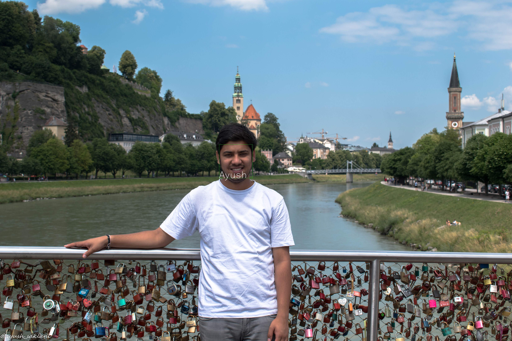

[](https://sourcerer.io/fame/ayushsaklani/ayushsaklani/face_recognition/links/0)[](https://sourcerer.io/fame/ayushsaklani/ayushsaklani/face_recognition/links/1)[](https://sourcerer.io/fame/ayushsaklani/ayushsaklani/face_recognition/links/2)[](https://sourcerer.io/fame/ayushsaklani/ayushsaklani/face_recognition/links/3)[](https://sourcerer.io/fame/ayushsaklani/ayushsaklani/face_recognition/links/4)[](https://sourcerer.io/fame/ayushsaklani/ayushsaklani/face_recognition/links/5)[](https://sourcerer.io/fame/ayushsaklani/ayushsaklani/face_recognition/links/6)[](https://sourcerer.io/fame/ayushsaklani/ayushsaklani/face_recognition/links/7)

# Real-Time Face Recognition and Detection using Openface

Face recognition using Deep Neural networks in images and videos. This repo includes verify.py to verify weather two images are of same person or not, webcam.py and video.py for webcams and videos respectively. database.py is used to create database for face detection which is used in webcam.py and video.py .  


### Prerequisites
 
 1. Pytorch
    Install Torch[http://torch.ch/] from the instructions on their website.
 2. Openface 0.2.1
    Install Openface[https://cmusatyalab.github.io/openface/setup/] from the instruction on their website.
 3. OpenCv 2.4.1 
 4. dlib 


## How to run it?

To run it make sure above Prerequsites are installed and working properly. Clone this repo to your local machine and execute python files.
 ```bash
 python verify.py --img1 "Path to first image" --img2 "Path to seconnd image"
 ```
 * To run face recognition on videos just run. 
  ```bash
  python video.opy --vid "Path to video file"
 ```
 But make sure before running webcam and video face recognition you create databse of the peoples you want to recognise in videos and images. 
 
 * To generate database just run 
 ```bash
 python database.py --path "path to image folder contaning images of people you want to add in databse make the filename of the image as the peron name who is in the image"
 ```

## Output

### Face Recognition




## Acknowledgments

* Hat tip to anyone whose code was used. 
* Openface[https://cmusatyalab.github.io/] for pretrained models.
* Inspiration


